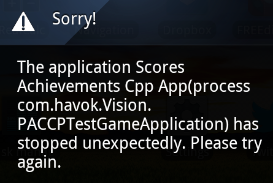

# Cloud Connection Examples

## Building the Examples

To build and run these examples successfully you must do the following:

### Run the RUN_ONCE.bat  

Be sure to run the `RUN_ONCE.bat` file to make sure the source compiles correctly in Visual Studio. This will copy in the data files required by the Vision engine to build and run the game, they are not included in the download to save space.

### Setting Your Google Application ID (for Android Builds)

Change the REPLACE_ME value for the value provided to you by Google. Note that although the value given to you by Google is numeric, it must stay marked as a "string" value in the xml file.

The value is found in this file...

`ScoresAchievementsCpp\Source\ScoresAchievementsCppApp\Platform\Android\res\values\ids.xml`

```xml

	<string name="app_id">REPLACE_ME</string>
```

If you [don't have a Google Application ID yet then you need to set one up](https://developers.google.com/games/services/console/enabling), have an look on the main README.md file for information on how to configure your game.

The *Package Name* for these example applications is `com.havok.Vision.PACCPTestGameApplication`

To find the SHA1 hash for your android debug key, you can use the following command line..

`keytool -exportcert -alias androiddebugkey -keystore %USERPROFILE%/.android/debug.keystore -list -v`

## Example - ScoresAchievementsCpp

Shows a simple xml GUI that allows you to interact with Google game services using the plugin's C++ interface.

* Login & out
* Show all achievements/Leaderboards
* Unlock a standard achievement
* Submit a score to a leaderboard

Initialisation of the Plugin is taken care of in **PluginMain.cpp**, (see the `OnInitEnginePlugin()` method). 
All of the Google interaction in this application happens inside **CloudConnectionGUI.cpp**

**CloudConnectionGUI.cpp** creates a GUI using the Vision xml GUI system allows you to give commands to the Google Play Games service.

This class also inherits from `IVisCallbackHandler_cl` so that it can listen for the Callbacks made by the Cloud Connection Plugin.

There are preprocessor defines for `#define ACHIEVEMENT_ID` and `#define LEADERBOARD_ID`, you should make at least one test Leaderboard and one Achievement in the Google play developer console and enter the Id's for them to test that you can add an achievement and submit a score.

## Example - ScoresAchievementsLua

Shows a simple xml GUI that allows you to interact with Google game services using the plugin's Lua interface.

* Login & out
* Show all achievements/Leaderboards
* Unlock a standard achievement
* Submit a score to a leaderboard

Initialisation of the Plugin is taken care of in **PluginMain.cpp**, (see the `OnInitEnginePlugin()` method). 
All of the Google interaction in this application happens inside **Scripts\CloudConnectionMenu.lua**

**Scripts\DefaultSceneScript.lua** loads and shows a GUI using the Vision xml GUI system allows you to give commands to the Google Play Games service.

**Scripts\CloudConnectionMenu.lua** handles all the processing of the menu and callbacks from the Cloud Connection Plugin.

There are lua local properties for `local ACHIEVEMENT_ID = ...` and `local LEADERBOARD_ID = ...`, you should make at least one test Leaderboard and one Achievement in the Google play developer console and enter the Id's for them to test that you can add an achievement and submit a score.

## Common Problems

### "Application ID (REPLACE_ME) must be a numeric value" - Runtime Error

You have not set your Google Application ID in the ids.xml. See the section "*Set Your Google Application ID*" in the Android Installation readme file.

The example app crashes out immediately on start-up...



and the following error can be found in the logcat output

```

	E/ValidateServiceOp(2857): Application ID (REPLACE_ME) must be a numeric value. Please verify 
	that your manifest refers to the correct project ID.
	I/ActivityManager(1641): Displayed com.havok.Vision.ScoresAchievementsCppApp/com.havok.Vision.CloudConnectionLifeCycleSupport: +1s445ms
	V/threaded_app(30633): NativeWindowCreated: 0x307480 -- 0x4fbb70
	V/threaded_app(30633): APP_CMD_INIT_WINDOW
	D/AndroidRuntime(30633): Shutting down VM
	W/dalvikvm(30633): threadid=1: thread exiting with uncaught exception (group=0x40018560)
	E/AndroidRuntime(30633): FATAL EXCEPTION: main
	E/AndroidRuntime(30633): java.lang.IllegalStateException: A fatal developer error has occurred. Check the logs for further information.
	E/AndroidRuntime(30633): 	at com.google.android.gms.internal.eh$h.b(Unknown Source)
```

### "Unable to resolve project target" - Build Error 

You need to make sure you have the Android 4.3 SDK installed or whatever SDK corresponds to "Google Inc.:Google APIs:18".

```

	1>  BUILD FAILED
	1>  C:\Android\sdk\tools\ant\build.xml:601: The following error occurred while executing this line:
	1>  C:\Android\sdk\tools\ant\build.xml:542: Unable to resolve project target 'Google Inc.:Google APIs:18'
```

To update which SDK target the build uses, see the following Google documentation ( [Updating a Project](http://developer.android.com/tools/projects/projects-cmdline.html#UpdatingAProject) | 
[Updating a Library Project](http://developer.android.com/tools/projects/projects-cmdline.html#UpdatingLibraryProject) ).

### Failure to Build when Building in `Release` mode

This kind of error is because you haven't specified any release keys to sign your application with.
Because the application doesn't get signed then the VisionInstallApk also then fails because the final output `.apk` has not been created.

```

	...
	-release-nosign:
	1>       [echo] No key.store and key.alias properties found in build.properties.
	1>       [echo] Please sign D:\ScoresAchievementsCpp\Source\ScoresAchievementsCppApp\Platform\Android\bin\CloudConnection-release-unsigned.apk manually
	1>       [echo] and run zipalign from the Android SDK tools
	...
	1>  -post-build:
	1>       [echo] **** -post-build *****
	1>  
	1>  BUILD FAILED
	1>  D:\ScoresAchievementsCpp\Source\ScoresAchievementsCppApp\Platform\Android\custom_rules.xml:104: The apk file 'D:\ScoresAchievementsCpp\Source\ScoresAchievementsCppApp\Platform\Android\bin\CloudConnection-release.apk' does not exist.
```

See the Google docs on [Building and Running from the Command Line -> Build signed and aligned](http://developer.android.com/tools/building/building-cmdline.html#AutoReleaseMode) to sign your release build properly.

In your `ant.properties` file you should add lines like the following as you can't prompt for a password when building from inside Visual Studio. 

```

	key.store=my-release-key.keystore
	key.alias=cloudconnection
	key.store.password=cloudconnection
	key.alias.password=cloudconnection
```

### When Trying To Connection to Google It Says I am UnAuthorised!!

There can be a few reasons for this.

#### Make Sure You Are on the "Testers" List

Before the Google game settings are published, you should make sure that whatever Google account you use for testing is on your testers list on the Google servers. If not then the sign-in will behave as if the game settings have not been created. Once the game settings are published then this restriction no longer applies.

#### Check You are building with the right key (Android)

If the SHA1 value for the key you are building with doesn't match the value you gave to Goolge when you setup your game services then it will appear as if the game doesn't exist.

#### Check You are building with the right package name (Android)

If the package name value in your `AndroidManifest.xml` doesn't match the value you gave to Goolge when you setup your game services then it will appear as if the game doesn't exist.