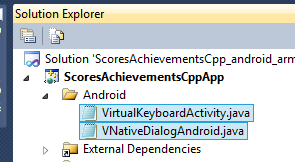

# Project Anarchy Cloud Connection Plugin Installation (Android)

This document shows you how to setup the plugin to work with your game. For details on how to use the plugin then please see the main README.md file.

## Download The Plugin

The plugin should be downloaded from GitHub to the following folder (you will need to create the "plugins" folder if it doesn't already exist)

`%HAVOK_THIRDPARTY_DIR%\plugins\cloud-connection`

(this folder is an alias of the following... `%VISION_SDK%\ThirdParty\plugins\cloud-connection`)


## Setup Your Visual Studio Project

The easiest way to setup your game is to use the included Visual Studio Property Sheets. The contain the settings you need to use the plugin in your game. They can be found in the following folder...

`%HAVOK_THIRDPARTY_DIR%\plugins\cloud-connection\PropertySheets`

Open your game solution in Visual Studio and go to the property manager tab...


Add the relevant existing property sheet to your Application configuration. There are property sheets available for your Application & Plugin for x86/Arm and  Debug/Dev & Release configurations...


The property sheet must be "above" the anarchy property sheet....


You will need to perform this step for all configurations that you want to use the Plugin (this includes the Win32 build as there is a Dummy Client available to do prototyping and testing on that platform)


## Java Project Setup

The use of the cloud connection plugin requires a custom Java setup, this will override the "Deploy APK" process that is provided by default in Project Anarchy and use the Google Android ANT build process.

After the native binaries have been built in Visual Studio, the Android ANT build process is called to finish the build or java classes and libraries and package the .apk output ready for deployment to the handset.

### Add The Java Project To Your Game

Copy the contents of:

`$(HAVOK_THIRDPARTY_DIR)\plugins\cloud-connection\Source\platform\Android`

into your games Application folder

`$(MY_GAME)\Source\$(MY_GAME_APPLICATION)\Platform\Android`

Your manifest, Android res and java source folders will now be located in the following places and will no longer be generated or updated by the Project Anarchy "Deploy APK" process.

* Android Manifest - `$(MY_GAME)\Source\$(MY_GAME_APPLICATION)\Platform\Android\AndroidManifest.xml`
* Android Res folder (icons etc ) - `$(MY_GAME)\Source\$(MY_GAME_APPLICATION)\Platform\Android\res`
* Java Source - `$(MY_GAME)\Source\$(MY_GAME_APPLICATION)\Platform\Android\src`

Your .apk file will now be built into the following folder:

* .apk output - `$(MY_GAME)\Source\$(MY_GAME_APPLICATION)\Platform\Android\bin`

### Exclude .java Files from Visual Studio

You should move any Java source files that you want compiled into your final .apk inside the Java source folder (inside the correct package folders as required by Java).

You should also exclude any .java files from your Visual Studio project if you have any listed as they will now be compiled by the ANT build process instead.



You might see errors like this `javac: file not found: Android\VNativeDialogAndroid.java` if you don't.

### Modify Your Manifest
 
If you already have been using your own customised AndroidManifest.xml than you can go ahead and replace the default `$(MY_GAME)\Source\$(MY_GAME_APPLICATION)\Platform\Android\AndroidManifest.xml` with your own.

*(Previously your manifest was auto-generated by the build script to `$(MY_GAME)\Source\$(MY_GAME_APPLICATION)\Platform\Android\AndroidTemp\armeabi-v7a\AndroidManifest.xml`)*

to use the Google Play Game Services you need to add these lines to your AndroidManifest.xml inside your `<application>` tag.

```xml

	<meta-data android:name="com.google.android.gms.games.APP_ID" android:value="@string/app_id" />`
	<meta-data android:name="com.google.android.gms.version" android:value="@integer/google_play_services_version" />
```

Also make sure your package name and android.app.lib_name are correct

**android.app.lib_name**

This should match with the name of the native binary that was built in Visual Studio e.g. PACCPTestGameApplication.so
 
```xml

	...
	<meta-data android:name="android.app.lib_name" android:value="PACCPTestGameApplication" />
	...
```

If this value is incorrect then you may see an error like the followin on app startup.... 

```

	W/dalvikvm(28229): threadid=1: thread exiting with uncaught exception (group=0x40018560)
	E/AndroidRuntime(28229): FATAL EXCEPTION: main
	java.lang.IllegalArgumentException: Unable to find native library: PACCPTestGameApplication
```

**Package Name**
```xml

	...
	<manifest xmlns:android="http://schemas.android.com/apk/res/android"
      	package="com.havok.Vision.PACCPTestGameApplication"
	...
```

### Set Your Google Application ID

There is a resource file located at `$(MY_GAME)\Source\$(MY_GAME_APPLICATION)\Platform\Android\res\values\ids.xml` in which you should put your **Google Application ID** that you obtained when you set up google play game services.

```xml

	<string name="app_id">REPLACE_ME</string>
```

### Enable Android 2.3 / 3.x Support If Required

To support Google Play Games services correctly on handsets that are less than Android 4.0 then you should use the activity class `com.havok.Vision.CloudConnectionLifeCycleSupport`

```xml

        <activity android:name="com.havok.Vision.CloudConnectionLifeCycleSupport"
		...
```

If you have your own custom Java Activity already then you can extend it from `com.havok.Vision.CloudConnectionLifeCycleSupport`

### Customising the Build Process

There is a `custom_rules.xml` file which grab's the native binaries that were compiled in Visual Studio and also places the assets required into the final .apk.

* Custom Build - `$(MY_GAME)\Source\$(MY_GAME_APPLICATION)\Platform\Android\custom_rules.xml`

This file has hooks in it to the Android build process and you should modify this file to suit your needs if required.

### Futher Reading

The [Google Android ANT Build Process Documentation](http://developer.android.com/tools/building/building-cmdline.html) is available online for further reading on how the build process works.

The [Vision ANT Tasks Documentation](Source/platform/Android/ant/VisionAntTasks/README.md) describes all the tasks that are used in the custom-rules.xml build file. 

## Manual Setup Android

This section describes all the settings you would require to setup the plugin manually if you do not want to use the property sheets.

#### Compiler params required to build with the google gpg pluging for android
* NDK tool chain version must be at least 4.8 for x86 build
* NDK tool chain version must be at least 4.6 for Arm build
* -std=gnu++11 
* -frtti 

#### PreProcessor Definitions required in developer plugin
* CLOUDCONNECTIONPLUGIN_IMPORTS in both the developer plugin and application

#### Win32 dll Only 
* Cloud Connection pluging dll must be coped into the exe target dir in the Post-Build Event step
xcopy /Y /D /C "CloudConnectionPlugin.vPluginD" "$(TargetDir)"


###include folders required

#### All platforms

`$(HAVOK_THIRDPARTY_DIR)\plugins\cloud-connection\Source`


#### Android
```

	$(HAVOK_THIRDPARTY_DIR)\plugins\cloud-connection\ThirdParty\redistsdks\gpg-cpp-sdk\V1.0\android\include
	$(NDKROOT)/platforms/android-9/arch-arm/usr/include
	$(NDKROOT)/sources/android/native_app_glue
```

###lib folders required

##### Arm
```

	$(HAVOK_THIRDPARTY_DIR)\plugins\cloud-connection\Lib\android_arm\debug (for debug only) 
	$(HAVOK_THIRDPARTY_DIR)\plugins\cloud-connection\Lib\android_arm\release (for release only) 
	$(HAVOK_THIRDPARTY_DIR)\plugins\cloud-connection\ThirdParty\redistsdks\gpg-cpp-sdk\V1.0\android\lib\armeabi-v7a
	$(NDKROOT)/platforms\android-9\arch-arm\usr\lib
	$(NDKROOT)/sources/cxx-stl/gnu-libstdc++/4.8/libs/armeabi-v7a
```

##### x86
```

	$(HAVOK_THIRDPARTY_DIR)\plugins\cloud-connection\Lib\android_arm\debug (for debug only) 
	$(HAVOK_THIRDPARTY_DIR)\plugins\cloud-connection\Lib\android_x86\release (for release only) 
	$(HAVOK_THIRDPARTY_DIR)\plugins\cloud-connection\ThirdParty\redistsdks\gpg-cpp-sdk\V1.0\android\lib\x86
	$(NDKROOT)/platforms\android-9\arch-x86\usr\lib
	$(NDKROOT)/sources/cxx-stl/gnu-libstdc++/4.8/libs/x86
```

### Libraries required for Linking
#### Cloud Connection Plugin
* -lCloudConnectionPlugin

#### google gpg plugin for android

* -lgpg
* -llog 
* -lz
* -lgnustl_static


#### already included by Project Anarchy project
* -landroid 
* -lEGL 
* -lGLESv1_CM

#### Android Manifest
Requires a customised Manifest from `cloud-connection\Data\Android\AndroidManifest.xml`

Add these lines to your AndroidManifest.xml

```xml

	<meta-data android:name="com.google.android.gms.games.APP_ID" android:value="@string/app_id" />`
	<meta-data android:name="com.google.android.gms.version" android:value="@integer/google_play_services_version" />
```

#### Android Activity		
Extend activity from this class to have pre-Android 4.0 support `com.havok.Vision.CloudConnectionLifeCycleSupport`

		
#### Android Google Play Services Java Library
Android build is reliant on this library (contains classes and resources), it must be compiled correctly into the final .apk
`$(HAVOK_THIRDPARTY_DIR)\plugins\cloud-connection\Source\platform\Android\google-play-services_lib\V4323000`

The Google Play Services APP_ID must be given in the xml in the developer build and compiled correctly into the final .apk
`res\values\ids.xml` - contains the `APP_ID` that must be changed for the developers Google Application

`<string name="app_id">REPLACE_ME</string>`
