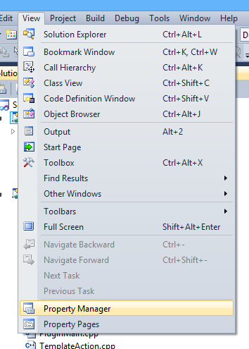
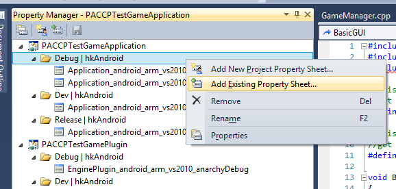
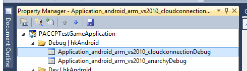
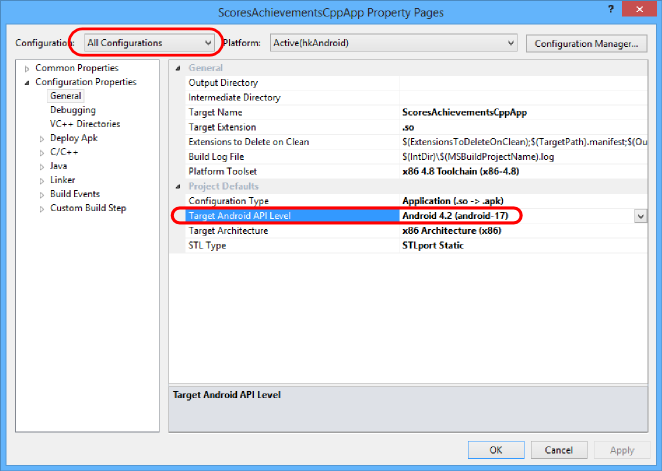

# Project Anarchy Cloud Connection Plugin Installation (Android)

This document shows you how to setup the plugin to work with your game. For details on how to use the plugin then please see the main [README.md](README.md) file.

## Download The Plugin

The plugin should be downloaded from GitHub to the following folder (you will need to create the "plugins" folder if it doesn't already exist)

`%HAVOK_THIRDPARTY_DIR%\plugins\cloud-connection`

(this folder is an alias of the following... `%VISION_SDK%\ThirdParty\plugins\cloud-connection`)


## Setup Your Visual Studio Project

The easiest way to setup your game is to use the included Visual Studio Property Sheets. The contain the settings you need to use the plugin in your game. They can be found in the following folder...

`%HAVOK_THIRDPARTY_DIR%\plugins\cloud-connection\PropertySheets`

Open your game solution in Visual Studio and go to the property manager tab...



Add the relevant existing property sheet to your Application configuration. There are property sheets available for your Application & Plugin for x86/Arm and  Debug/Dev & Release configurations...



The property sheet must be "above" the anarchy property sheet....




You will need to perform this step for all configurations that you want to use the Plugin (this includes the Win32 build as there is a Dummy Client available to do prototyping and testing on that platform)

## Java Project Setup

The use of the cloud connection plugin requires some extra Java code, libraries and resources.
To use the Google Java libraries you **must** build with a higher API Target than `android-10`.

Set the `Android API Target Level` to at least `Android 4.2 (android-17)`. Make sure you do this for `All Configurations`.



### Add The Java Project To Your Game

Copy the contents of:

`$(HAVOK_THIRDPARTY_DIR)\plugins\cloud-connection\Source\platform\Android`

into your games Application folder

`$(MY_GAME)\Source\$(MY_GAME_APPLICATION)\Platform\Android`

Your manifest, Android res and java source folders will now be located in the following places and will no longer be generated or updated by the Project Anarchy "Deploy APK" process.

* Android Manifest - `$(MY_GAME)\Source\$(MY_GAME_APPLICATION)\Platform\Android\AndroidManifest.xml`
* Android Res folder (icons etc ) - `$(MY_GAME)\Source\$(MY_GAME_APPLICATION)\Platform\Android\res`
* Java Source - `$(MY_GAME)\Source\$(MY_GAME_APPLICATION)\Platform\Android\src`

### Include .java Files in Visual Studio

There are a few java source files that should be added to your visual studio project so they can be compiled into the final .apk file.

`$(MY_GAME)\Source\$(MY_GAME_APPLICATION)\Platform\Android\src\com\havok\Vision\CloudConnectionLifeCycleSupport.java`
`$(MY_GAME)\Source\$(MY_GAME_APPLICATION)\Platform\Android\src\com\havok\Vision\VirtualKeyboardActivity.java`
`$(MY_GAME)\Source\$(MY_GAME_APPLICATION)\Platform\Android\src\com\havok\Vision\VNativeDialogAndroid.java`

Note, you may already have `VirtualKeyboardActivity.java` and `VNativeDialogAndroid.java` included. `CloudConnectionLifeCycleSupport.java` is only required if you want to support devices of previous to Android 4.0

### Modify Your Manifest
 
If you already have been using your own customised AndroidManifest.xml than you can go ahead and replace the default `$(MY_GAME)\Source\$(MY_GAME_APPLICATION)\Platform\Android\AndroidManifest.xml` with your own.

*(Previously your manifest was auto-generated by the build script to `$(MY_GAME)\Source\$(MY_GAME_APPLICATION)\Platform\Android\AndroidTemp\armeabi-v7a\AndroidManifest.xml`)*

to use the Google Play Game Services you need to add these lines to your AndroidManifest.xml inside your `<application>` tag.

```xml

	<meta-data android:name="com.google.android.gms.games.APP_ID" android:value="@string/app_id" />`
	<meta-data android:name="com.google.android.gms.version" android:value="@integer/google_play_services_version" />
```

Also make sure your package name and android.app.lib_name are correct

**android.app.lib_name**

This should match with the name of the native binary that was built in Visual Studio e.g. PACCPTestGameApplication.so
 
```xml

	...
	<meta-data android:name="android.app.lib_name" android:value="PACCPTestGameApplication" />
	...
```

If this value is incorrect then you may see an error like the followin on app startup.... 

```

	W/dalvikvm(28229): threadid=1: thread exiting with uncaught exception (group=0x40018560)
	E/AndroidRuntime(28229): FATAL EXCEPTION: main
	java.lang.IllegalArgumentException: Unable to find native library: PACCPTestGameApplication
```

**Package Name**
```xml

	...
	<manifest xmlns:android="http://schemas.android.com/apk/res/android"
      	package="com.havok.Vision.PACCPTestGameApplication"
	...
```

### Set Your Google Application ID

There is a resource file located at `$(MY_GAME)\Source\$(MY_GAME_APPLICATION)\Platform\Android\res\values\ids.xml` in which you should put your **Google Application ID** that you obtained when you set up google play game services.

```xml

	<string name="app_id">REPLACE_ME</string>
```

### Enable Android 2.3 / 3.x Support If Required

To support Google Play Games services correctly on handsets that are less than Android 4.0 then you should use the activity class `com.havok.Vision.CloudConnectionLifeCycleSupport`

```xml

        <activity android:name="com.havok.Vision.CloudConnectionLifeCycleSupport"
		...
```

If you have your own custom Java Activity already then you can extend it from `com.havok.Vision.CloudConnectionLifeCycleSupport`

