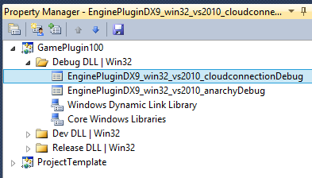

# Project Anarchy Cloud Connection Plugin Installation (Win32)

This document shows you how to setup the plugin to work with your game. For details on how to use the plugin then please see the main [README.md](README.md) file.

## Download The Plugin

The plugin should be downloaded from GitHub to the following folder (you will need to create the "plugins" folder if it doesn't already exist)

`%HAVOK_THIRDPARTY_DIR%\plugins\cloud-connection`

(this folder is an alias of the following... `%VISION_SDK%\ThirdParty\plugins\cloud-connection`)

## Setup Your Visual Studio Project

The easiest way to setup your game is to use the included Visual Studio Property Sheets. The contain the settings you need to use the plugin in your game. They can be found in the following folder...

`%HAVOK_THIRDPARTY_DIR%\plugins\cloud-connection\PropertySheets`

Open your game solution in Visual Studio and go to the property manager tab...

Add the relevant existing property sheet to your Application configuration. There are property sheets available for your Win32 Application & Plugin for both Debug & Dev configurations...

The property sheet must be "above" the anarchy property sheet....

Once the property sheets have been added, you are able to use a Dummy Client for prototyping and testing on the Win32 platform.
